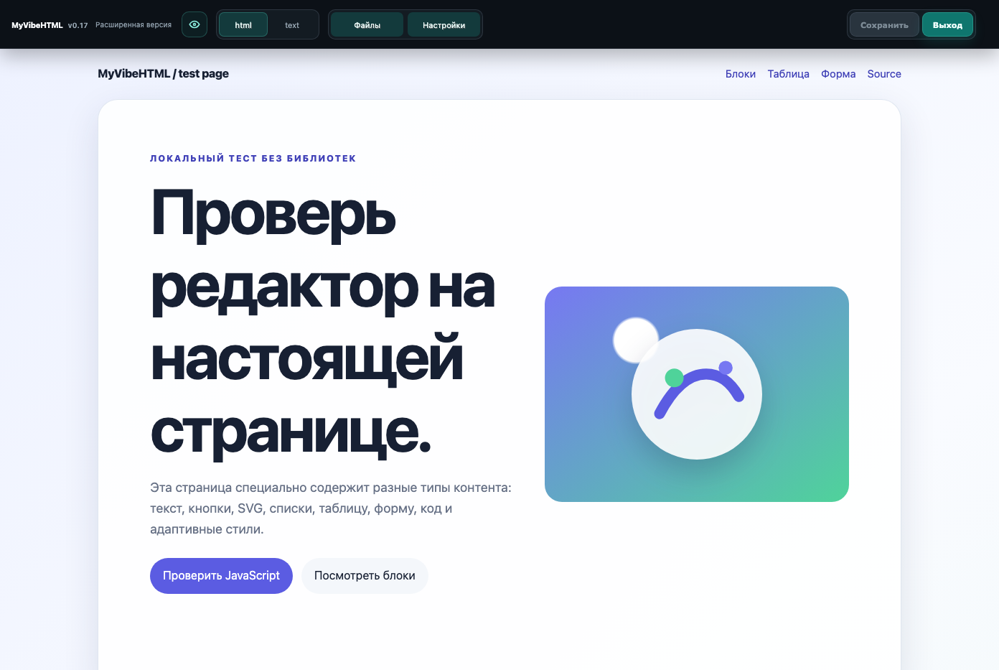
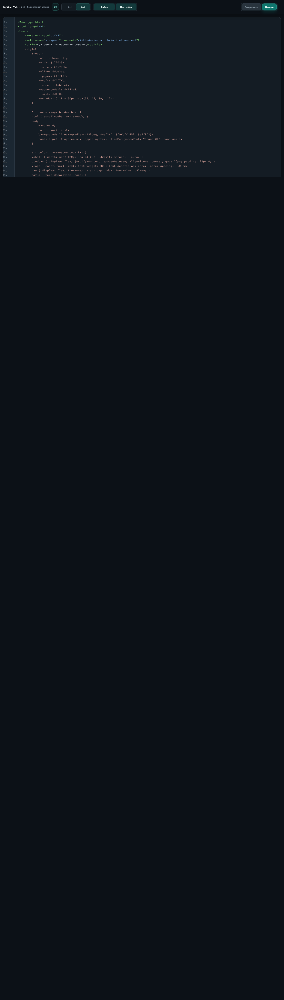
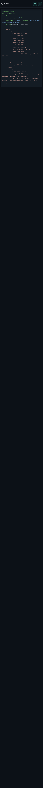
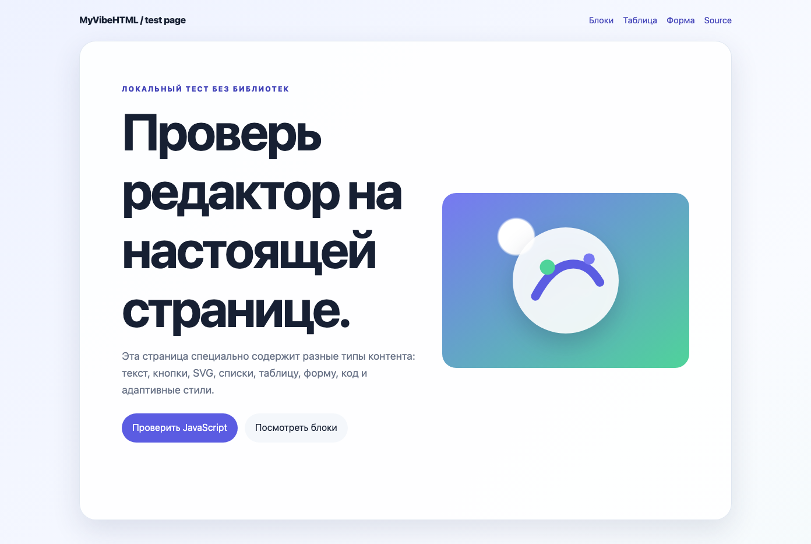
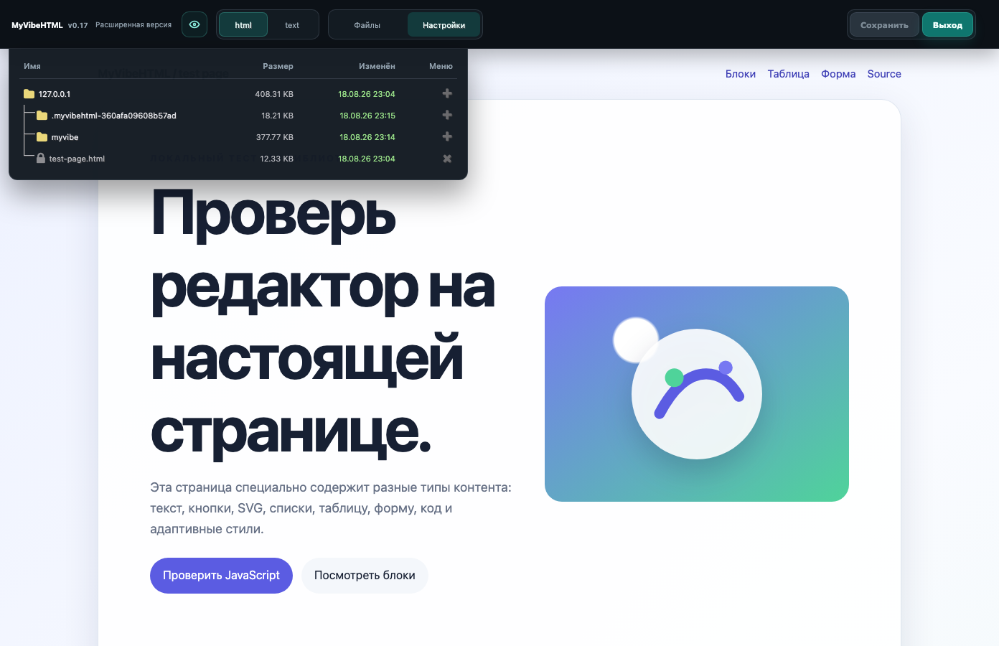
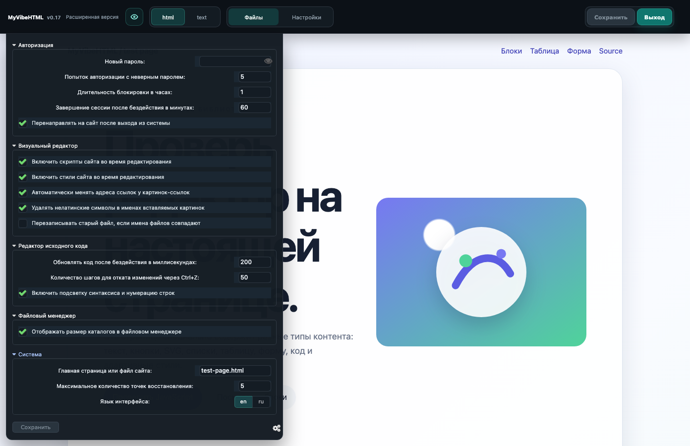

# MyVibeHTML

MyVibeHTML — локальный визуальный редактор HTML-страниц. Он работает внутри сайта на PHP, открывает выбранный файл в iframe, позволяет менять текст и структуру блоков, а исходный код редактировать в отдельной вкладке.

Текущая версия: **0.23**.

## Возможности

- визуальное редактирование страницы в iframe;
- вкладки `html` и `text` без перехода на страницу авторизации;
- контекстное меню по правой кнопке мыши;
- выделение элемента, секции и блока;
- CSS-инспектор выделенного узла: live-применение разрешённых свойств, сброс и сохранение в HTML;
- операции с выделенным блоком: копирование, перемещение вверх/вниз, удаление и работа с атрибутами;
- файловый менеджер с переходом по каталогам, размером, датой изменения, загрузкой, удалением и точками восстановления;
- настройки авторизации, визуального редактора, исходного кода, файлового менеджера и системы;
- кнопка-глаз для открытия страницы напрямую, без панели редактора;
- адаптивная панель с бургер-меню на маленьких экранах;
- локальные SVG-иконки без runtime-запросов к внешним доменам;
- защитные HTTP-заголовки, CSP Report-Only, проверки путей и атомарная запись файлов.

## Скриншоты

Скриншоты ниже сняты в браузерной проверке v0.18; v0.20 добавляет регрессионные проверки, расширенное контекстное меню, безопасный вывод статусов и подробную документацию; v0.21 — CSS-инспектор; v0.22 — текущие CSS-значения, замену изображений/иконок и нижнюю desktop-панель инспектора. Базовая UI-геометрия сохранена.













## Требования

- PHP 7.4+ рекомендуется; версия проекта проверена на PHP 8.5;
- Apache с `mod_rewrite` или Nginx с PHP-FPM;
- доступ PHP к записи runtime-каталога и конфигурации;
- JavaScript и cookies в браузере.

В проекте нет `composer.json`, `package.json` и runtime-загрузки npm/Composer-библиотек. Иконки заранее сохранены локально. Их источники и лицензия указаны в [`myvibehtml-icons/README.md`](myvibehtml-icons/README.md).

## Установка на Apache

Подробный production-чеклист для Apache, Nginx/PHP-FPM, локального запуска, прав и диагностики находится в [`docs/deployment.md`](docs/deployment.md).

1. Скопируйте каталог `myvibe` внутрь document root сайта. Например:

   ```text
   /var/www/example/myvibe/
   ```

2. Разместите `myvibehtml.php`, `myvibehtml.js`, CSS, `myvibehtml-icons/` и `lang.ini` в одном каталоге.

3. Скопируйте `.htaccess` из проекта в каталог редактора или в document root — в зависимости от того, какой URL должен вести на `myvibehtml.php`.

4. Убедитесь, что PHP может создать runtime-каталог вида `.myvibehtml-<hash>` рядом с document root. Конфигурация и блокировки не должны быть доступны из браузера.

5. Откройте URL редактора, например:

   ```text
   https://example.test/myvibehtml.php?q=index.html
   ```

6. После первого входа сразу задайте собственный пароль в настройках. Пароль в репозитории не хранится.

## Установка на Nginx

Используйте [`nginx.conf.example`](nginx.conf.example) как основу для server block. В конфигурации обязательно должны присутствовать:

- `try_files` с fallback на `myvibehtml.php`;
- `SCRIPT_FILENAME` для PHP-FPM;
- запрет dotfiles, `backup/`, `*.ini` и `*.log`;
- ограничение размера загрузки через `client_max_body_size`;
- HTTPS для production.

Путь к сокету PHP-FPM (`fastcgi_pass`) замените на путь вашей системы. Перед reload проверьте конфигурацию командой `nginx -t`.

## Локальный запуск

Для тестового сайта с document root `/path/to/site`:

```bash
php -S 127.0.0.1:8080 -t /path/to/site /path/to/site/myvibe/dev-router.php
```

Если `myvibe` лежит внутри document root, передавайте router из фактического document root. Нельзя запускать PHP-сервер с корнем самого каталога плагина, если конфигурация сайта рассчитана на родительский document root: это приводит к несовпадению путей и ошибке `Проблема с DOCUMENT_ROOT`.

## Авторизация и DOCUMENT_ROOT

Надпись `Проблема с DOCUMENT_ROOT` в форме означает, что сервер не смог корректно определить или записать конфигурацию сайта. Проверьте:

1. `DOCUMENT_ROOT` указывает на реальный document root сайта;
2. файл `conf.ini` доступен PHP на запись;
3. runtime-каталог `.myvibehtml-<hash>` создаётся рядом с document root;
4. URL редактора не смешивает document root сайта и отдельный корень каталога плагина;
5. при Nginx корректно настроен `SCRIPT_FILENAME`.

После нескольких неверных попыток вход временно блокируется согласно настройкам. В production не очищайте конфигурацию вручную без резервной копии.

## Работа в редакторе

### Визуальный режим

Вкладка `html` показывает страницу в iframe. Нажатие на объект выделяет его, а правая кнопка открывает контекстное меню. В меню доступны уровни `main`, `section`, `div` и текущий текстовый элемент. Нижняя панель содержит действия над выбранным блоком.

### CSS-инспектор

Выделите элемент или секцию, нажмите правую кнопку мыши и выберите `Изменить CSS`. Инспектор показывает вычисленные и inline-значения и разрешает менять 13 свойств: `display`, размеры, отступы, `gap`, типографику, цвет, фон и скругление. Изменения видны сразу в iframe, кнопка `Сбросить` удаляет добавленный inline-стиль, а `Сохранить` записывает его в исходный HTML. На desktop инспектор закреплён справа, на mobile открывается нижней прокручиваемой панелью.

### Исходный код

Вкладка `text` открывает код текущего файла. Переключение выполняется AJAX-запросом и сохраняет текущую авторизованную сессию. Кнопка `Сохранить` появляется в панели после изменения содержимого.

### Просмотр сайта

Кнопка с глазом открывает `site_preview_url` в новой вкладке. Это прямой URL HTML-файла, поэтому в адресе нет `?q=...` и панели редактора.

### Файлы

Файловый менеджер показывает только безопасные пути внутри настроенного корня. Скрытые служебные файлы, `conf.ini`, журналы и каталог backup блокируются на уровне приложения и веб-сервера.

### Настройки

Разделы настроек раскрываются по клику на заголовок. Изменения применяются кнопкой `Сохранить`; пароль и параметры сессии меняйте только через авторизованную панель.

## Основные функции

Полный каталог PHP-классов, методов и JavaScript runtime-ролей находится в [`docs/function-catalog.md`](docs/function-catalog.md). Ниже — краткая карта основных потоков.

### PHP

| Функция | Назначение |
|---|---|
| `myvibehtml_runtime_directory()` | Выбирает изолированный runtime-каталог вне публичного дерева сайта. |
| `myvibehtml_atomic_write()` | Записывает конфигурацию и служебные файлы через lock-файл, временный файл и атомарный `rename`. |
| `myvibehtml_unserialize_array()` | Безопасно читает legacy-массивы с отключёнными пользовательскими классами. |
| `MyVibeHTMLRequest` | Нормализует GET/POST/cookie/server-параметры и типы входных данных. |
| `MyVibeHTMLResponse` | Формирует ответ, cookies, статусы и security headers. |
| `MyVibeHTMLConfig` | Загружает настройки, шаблоны, переводы и состояние document root. |
| `MyVibeHTMLController::authenticate()` | Проверяет сессию или пароль, учитывает лимит ошибок и блокировку. |
| `MyVibeHTMLController::dispatch()` | Маршрутизирует просмотр, сохранение, загрузку, удаление, recovery и настройки. |
| `normalizeRelativePath()` | Приводит относительный путь к безопасному виду и отклоняет traversal. |
| `getSafeSitePath()` | Проверяет, что путь существует или создаётся внутри настроенного корня. |
| `escapeHtml()` | Экранирует динамические значения перед вставкой в HTML-шаблоны. |
| `renderFileList()` | Строит файловый список с экранированными именами, датами, размерами и URL. |
| `copyFileAtomically()` | Создаёт backup потоковой копией через временный файл без перезаписи symlink. |
| `createBackup()` | Создаёт и ограничивает точки восстановления перед изменением файла. |

### JavaScript

| Функция/механизм | Назначение |
|---|---|
| `openDirectory()` | Загружает и обновляет файловый список без вставки сырого server response. |
| `replaceFileListFragment()` | Парсит ответ через `DOMParser`, оставляет только разрешённые теги/атрибуты и добавляет `DocumentFragment`. |
| обработчик вкладок | Переключает визуальный и исходный режимы с сохранением сессии. |
| обработчик preview | Открывает прямой URL сайта в новой вкладке. |
| обработчик context menu | Показывает уровни DOM и действия над выбранным элементом. |
| обработчик mobile menu | Открывает бургер и направляет пункты меню к соответствующим контролам панели. |

## Безопасность

- внешнее обновление и удалённые endpoints отключены;
- `conf.ini`, backup, dotfiles, `*.ini` и `*.log` закрыты в Apache/Nginx/router;
- symlink не принимаются как конфигурация, исходный файл или backup-цель;
- конфигурация, HTML и резервные копии сохраняются атомарно, а backup хранится в runtime-каталоге вне document root;
- задаются `X-Content-Type-Options`, `X-Frame-Options`, `Referrer-Policy`, `Permissions-Policy`, `Cache-Control` и `X-Permitted-Cross-Domain-Policies`;
- CSP работает в режиме Report-Only, потому что редактируемая страница может содержать собственные inline-скрипты и стили. Сначала соберите отчёты, затем отдельно принимайте решение о переходе к enforcing-политике.
- статусные сообщения панели и файлового менеджера выводятся через `textContent`; `innerHTML` оставлен только в штатном source/visual HTML-потоке редактора;
- ответ списка файлов разбирается через `DOMParser` и allowlist тегов/атрибутов до вставки в DOM.

Проверка проекта:

```bash
sh security-smoke.sh
MYVIBEHTML_BASE_URL=http://127.0.0.1:8080 sh tests/regression.sh
php -l myvibehtml.php
php -l dev-router.php
node --check myvibehtml.js
git diff --check
```

## Известные ограничения

- проект рассчитан на один сайт и локальное администрирование, а не на многопользовательскую CMS;
- CSP не блокирует содержимое редактируемого сайта, пока не проведена отдельная настройка его разрешённых источников;
- реальный production acceptance зависит от прав PHP-FPM, Apache/Nginx rewrite и структуры document root.

## Внешние источники и библиотеки

Runtime-библиотеки отсутствуют. Единственные внешние источники относятся к заранее скачанным SVG-иконкам Tabler через Iconify; ссылки и MIT-лицензия перечислены в [`myvibehtml-icons/README.md`](myvibehtml-icons/README.md). При работе редактора запросы к Iconify, Flaticon и `textolite.ru` не выполняются.
